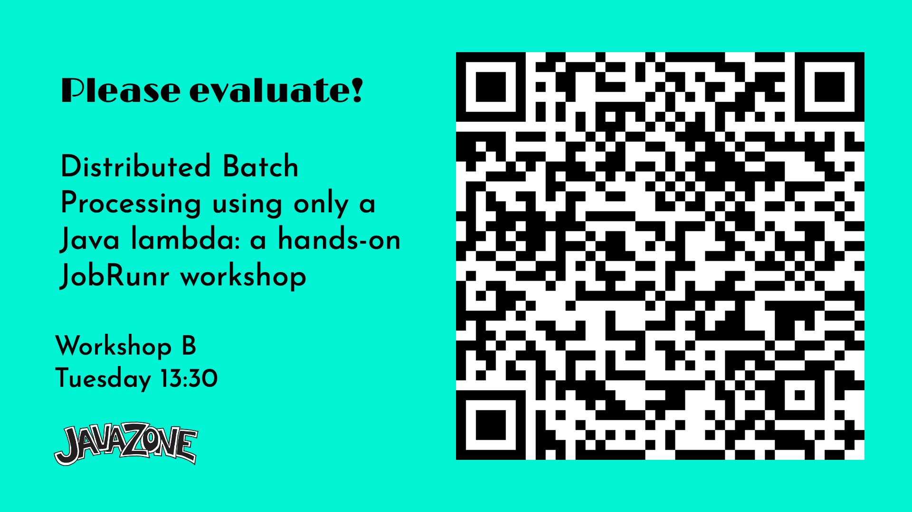

# JavaZone Hands-On Lab

### Overview

This workshop will give you an intro to JobRunr and we will be:

0. Configuring JobRunr with Spring Boot
1. Enqueueing a Job with JobRunr
    1. using a Java 8 Lambda and the `JobScheduler` API
    2. using a `JobRequest` and the `JobRequestScheduler` API
2. Monitoring jobs with the Dashboard
    1. changing job name in the dashboard
    2. using labels
    3. logging and job progress
3. Ooh no - an exception occurred!
4. Scheduling a Job
5. Creating a Recurring Job using the `@Recurring` annotation
6. Creating a Recurring Job using the `JobScheduler` or `JobRequestScheduler` API
7. Distributed processing!

### Please rate the Workshop!

 or
use [this URL](https://macsimum.no/?tripetto=91b2e2e2a0f048ff3ba35d374055c50db3d9c5c6dbd2b6c2ef89c6f8d39e79e1&slotid=Workshop%20B%20Tue%2013%3A30)